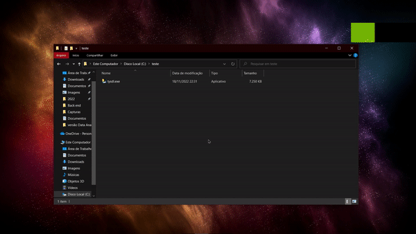
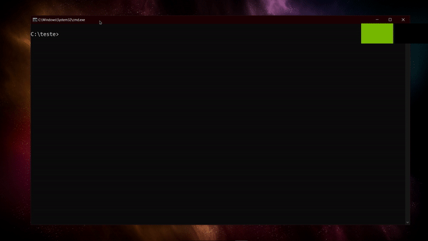
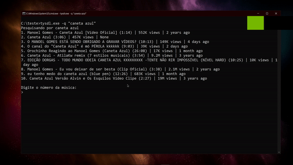
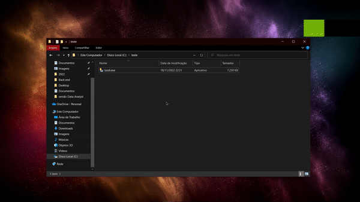
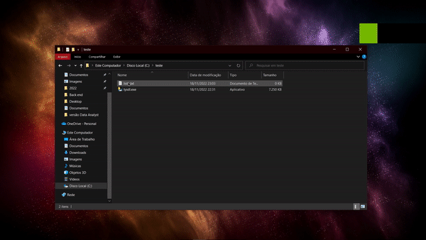
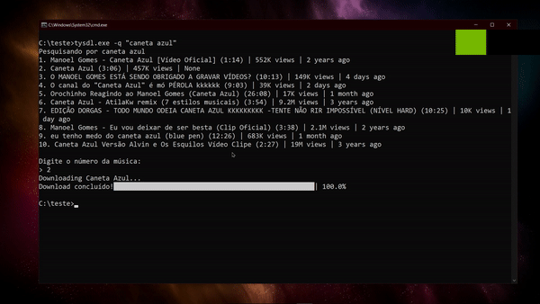
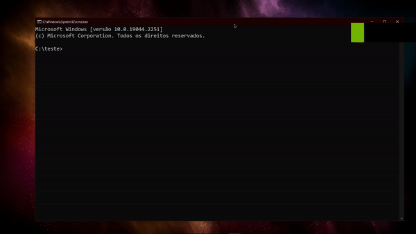

# True Youtube Songs Downloader
[](https://www.gnu.org/licenses/gpl-3.0)
[](https://www.python.org/)


*🎶 EI, VOCÊ AI 👉! Isso vai mudar a sua vida, então tente me ouvir... 🎶*

Quantas vezes você se deparou com a seguinte situação:

>"Preciso baixar uma musica do youtube mas só tem site com 976 propagandas e muito provavel vai vir um virus 😥😭😭"

Ou pior:

>"Achei um site bom, mas tenho que ir no Youtube e pegar o link da musica e depois baixar, que tristezinha 😭"

Venho te informar que os seus problemas acabaram 🥳🎇.

Com o **True Youtube Song Downloader** (sim, aceito sugestões de nome 😥) facilita e muito a sua vida, de forma simples e gratuita!

## Como funciona?

O script é bem simples, pois é para isto mesmo que eu o criei — para facilitar a minha, a sua, a nossa vida de quem um dia precisa ter músicas offline 😜!

No momento não possui GUI e é executado via CLI, mas é MUITO simples, sério.

Ah, todas as músicas são baixadas na *sua* pasta de Downloads por padrão 😉🤗

### Convertendo apenas uma música
Na sua pasta onde está o executável, clique na barra de endereço do seu Explorer e digite "cmd" e pressione **Enter** 



Para executar o programa para baixar apenas uma música, digite o nome do executável e os comandos **-q ou --query** e em aspas o nome da música e em seguida, pressione **Enter** como o exemplo abaixo:

```sh
    tysdl.exe -q "caneta azul"
```


Após feita a pesquisa, basta agora apenas selecionar o vídeo a ser convertido que o programa faz todo o resto!



### Convertendo uma lista de músicas
Para converter usando uma lista de músicas, primeiro você deve ter ela no formato *.txt*. Caso já possua os nomes na lista, recomendo colocar na pasta destino do programa. Caso ainda não tenha uma, recomendo o método a seguir:

#### Criando lista na pasta do programa
Clique com o botão direito, vá em **Novo** e clique em **Documento de Texto** e o nomeie como **lista**



Abra a sua lista e coloque os nomes das músicas a serem pesquisadas e em seguida salve o arquivo



E agora? Como usa a lista? *Beeeeem* simples!

No CMD, digite o nome do programa e o comando **-l ou --list** e informe o diretório da lista. Caso já esteja na mesma pasta do programa, apenas digite o nome da lista com a extensão .txt, como por exemplo:

```sh
    tysdl.exe -l "lista.txt"
```



### Convertendo uma playlist INTEIRA
>E vem cá João... mas teria como converter uma playlist inteira 👀👀?

R: SIM! 🙌😜🥳

Basta você pesquisar o nome da música ou playlist desejada usando o comando **-q ou --query** e tendo dentro da sua pesquisa o termo **playlist** como no exemplo a seguir:

```sh
    tysdl.exe -q "caneta azul playlist"
```



## Considerações finais
Bom, fiz esta solução pois é insuportável ter que obter um mp3 nos dias atuais com a internet infestada de propagandas. 
É uma humilde solução totalmente gratuita **(e vai permanecer assim)** para ajudar eu e você a curtir o bem cultural como a música de forma simples, rápida e fácil.

Planejo trazer outras atualizações, até porque nem sequer foi totalmente testada, então pode-se dizer que é um "alfa aberto" e conto com **VOCÊ** para me ajudar nessa jornada para tornar este pequeno freeware mais bem polido e com erros nulos.
